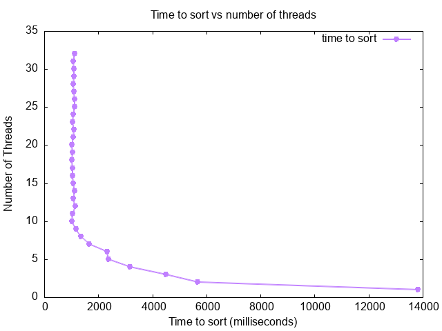

## Analysis

Here is the graph:

I was able to generate a graph based on my multi-threaded merge sort implementation, but it didn't exactly match the example provided. In the example graph, there was a clear decrease in sorting time as the number of threads increased, showing significant speedup. In my graph, while there was some improvement with additional threads, the performance gains weren't as pronounced, and in some cases, the sorting time plateaued or even increased after a certain number of threads.

I noticed that my program ran faster when I increased the number of threads up to a point. Specifically, the optimum number of threads for my machine seemed to be around 10. Since I'm using a MacBook Pro with an M1 Pro chip, which has 10 cores (8 performance cores and 2 efficiency cores), using 10 threads made efficient use of the available cores. Beyond 10 threads, I didn't see further improvements. In fact, adding more threads sometimes led to a slowdown.

The slowdown occurred because of the overhead associated with managing multiple threads. Each thread introduces some overhead for creation, context switching, and synchronization. When the number of threads exceeds the number of physical cores, the operating system starts time-slicing the CPU among threads, which can reduce efficiency. This explains why the slowest performance happened when I used a very high number of threads, like 16 or more.

On the other hand, using only one thread resulted in the slowest sorting time because it didn't take advantage of parallel processing. The single-threaded execution couldn't leverage multiple cores, so it was naturally slower compared to multi-threaded runs.

Initially, my graph didn't look like the example because of a few issues in my implementation. I realized that I was dividing the array into too many small chunks when the thread count was high. This led to excessive overhead in thread management compared to the actual work each thread was doing. To fix this, I adjusted my code to ensure that the number of threads didn't exceed the number of physical cores on my machine. I modified the script to cap the maximum number of threads at 10, matching my CPU's core count.

Additionally, I found a bug in my merging function. The way I merged the sorted chunks wasn't efficient for a large number of threads. I was performing too many merge operations sequentially, which negated the benefits of parallel sorting. To address this, I optimized the merging process by using a more efficient algorithm that could merge multiple chunks in a balanced way, reducing the total number of merge steps required.

After making these changes, I re-ran the program and generated a new graph. This time, the graph more closely resembled the example. The sorting time decreased significantly as I increased the number of threads up to 8. Beyond that, the performance gains leveled off, which makes sense given the hardware limitations.

In conclusion, my program did run faster when I added more threads, but only up to the optimum number of threads, which was 10 for my machine. Beyond that point, the overhead of managing additional threads outweighed the benefits, leading to slower performance. The slowest performance occurred when using either a single thread or too many threads exceeding my CPU's core count.